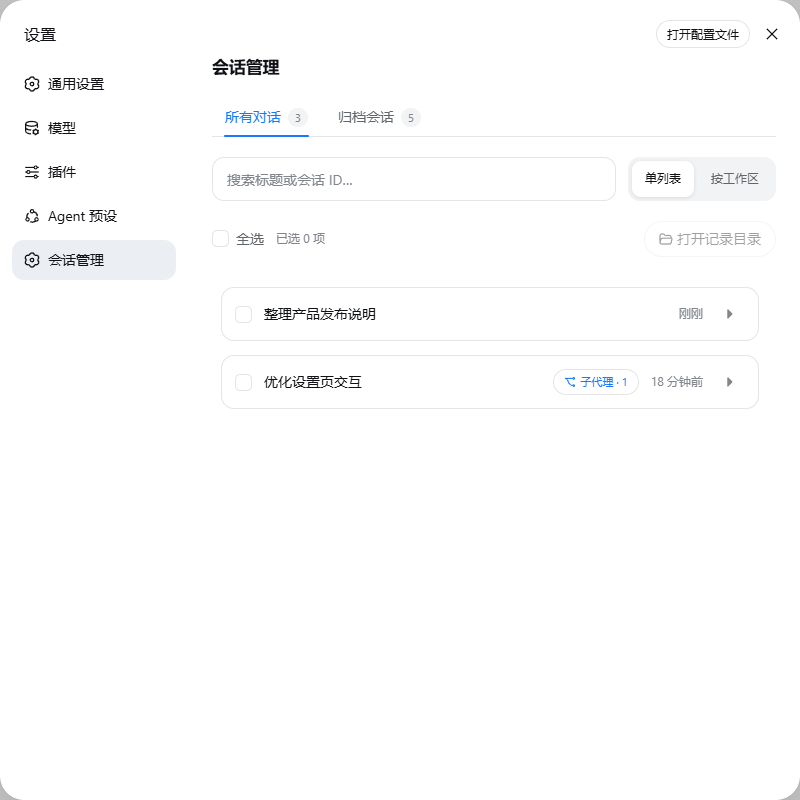
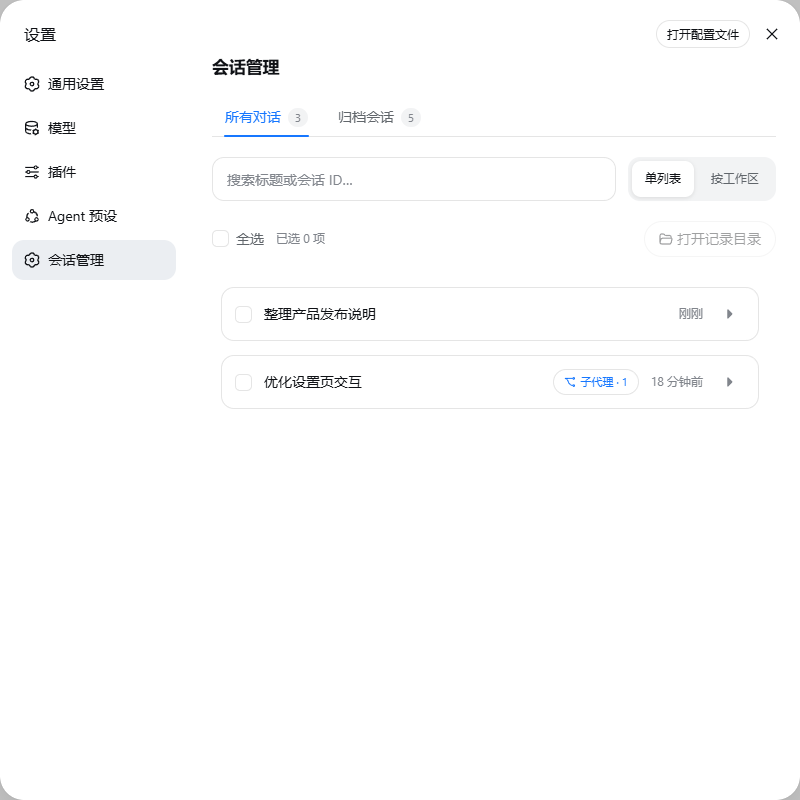
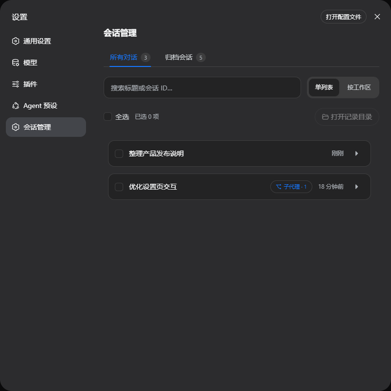

# 🗂️ dsh-conversation-manager

[简体中文](./README.md)

> Safe, focused session archiving and record management for DeepSeek Harness.

[](https://www.npmjs.com/package/dsh-conversation-manager)
[](https://www.npmjs.com/package/dsh-conversation-manager)
[](https://github.com/lanlandeli/dsh-conversation-manager/actions)
[](https://nodejs.org)
[](./LICENSE)

`dsh-conversation-manager` is a session manager for the DeepSeek Harness Web UI. It brings active and archived conversations, subagent relationships, activity summaries, and local output files into one interface, with explicit confirmation and filesystem boundaries around permanent deletion.

The plugin integrates through Harness services and UI slots without patching official npm packages or the Web UI DOM. Session data is read and processed locally.

```sh
dsh plugin --profile web add dsh-conversation-manager
```

Restart the Web profile, then open **Session manager** in Settings.

Update or remove the plugin:

```sh
dsh plugin --profile web update dsh-conversation-manager
dsh plugin --profile web remove dsh-conversation-manager
```

## Demo

> These assets use synthetic demo data and contain no real sessions, paths, or file information.



## Screenshots

<details>
<summary>View light theme</summary>



</details>

<details>
<summary>View dark theme</summary>



</details>

## Features

| Module | Description |
| --- | --- |
| **Archive and restore** | Move conversations into the archive or restore them without deleting their records |
| **Batch management** | Drag-select, select all, archive, restore, or permanently delete multiple sessions; failed items remain selected for retry |
| **Search and grouping** | Search by title or session ID and switch between a flat list and workspace groups |
| **Subagent relationships** | Keep subagents hidden by default and reveal them under their parent, including nested relationships and search results |
| **Session details** | Inspect disk usage, last update, message and tool counts, web fetches, and parent/child relationships |
| **Record directory** | Open the exact session record directory used for the displayed disk-size calculation |
| **Output cleanup** | Delete only regular files recorded as outputs of that session and located inside a registered workspace |
| **Chinese and English UI** | Follow the Harness language setting automatically |

## Deletion behavior

- **Archive conversation** changes archive state only; it does not delete records.
- **Delete selected** permanently removes the selected session records and cannot be undone.
- Deleting a parent does not cascade to subagents. Only explicitly selected sessions are deleted.
- Running sessions are rejected. The session currently open in the UI cannot be selected there.
- **Delete selected files** permanently removes files from disk and is intended only for outputs you no longer need.

Back up important data separately. This plugin is not a backup or recycle-bin service.

## Security boundaries

An output file can be deleted only when all of these conditions hold:

1. The request contains a valid session ID.
2. The path appears in that session's recorded output list.
3. The target is a regular file, not a directory or symbolic link.
4. Its resolved real path is strictly inside a registered Harness workspace and is not the workspace root.

Session record directories come from Harness persistence's public `locate(meta)` contract; the plugin does not derive or assume a JSONL layout. The browser API accepts same-origin POST requests on loopback hosts only and limits request-body size. See the [security policy](./SECURITY.md) and [privacy notice](./PRIVACY.md).

## Compatibility

The verified baseline is DeepSeek Harness `0.1.0-rc.7`, Node.js `22.19+` or `24+`, and the official Web profile. The interface supports light and dark themes and desktop wrappers that load the same-origin Web UI.

Harness is evolving rapidly. Other versions may work but are outside the current verified range. See [Compatibility](./docs/COMPATIBILITY.md).

## Development

```sh
npm ci
npm run release:check
```

| Path | Purpose |
| --- | --- |
| `src/index.ts` | Host API, detail aggregation, archive, restore, and deletion operations |
| `src/server/path-security.ts` | Real-path fences for session records and workspace files |
| `src/client/index.tsx` | Settings interface, detail cards, and interaction state |
| `src/client/model.ts` | Search, workspace grouping, and subagent tree model |
| `src/client/batch.ts` | Batched operations that retain per-item results |
| `src/client/i18n.ts` | Chinese and English interface copy |
| `src/client/styles.ts` | Responsive styles, themes, and motion |
| `tests/` | Path-security, batching, and state-model tests |

Generated files are written to `lib/`; do not edit them directly. Read [Contributing](./CONTRIBUTING.md) before submitting changes.

## Issues

For a missing settings entry, incomplete session list, incorrect record directory, or display problem, [open an Issue](https://github.com/lanlandeli/dsh-conversation-manager/issues/new) with the Harness, plugin, and Node.js versions, the installation command, reproduction steps, and sanitized logs or screenshots.

Do not post API keys, access tokens, prompts, session logs, or full local paths in a public Issue. Report vulnerabilities privately as described in the [security policy](./SECURITY.md).

## License

[MIT](./LICENSE). The project includes portions modified from upstream MIT-licensed code; see `LICENSE` for attribution.
